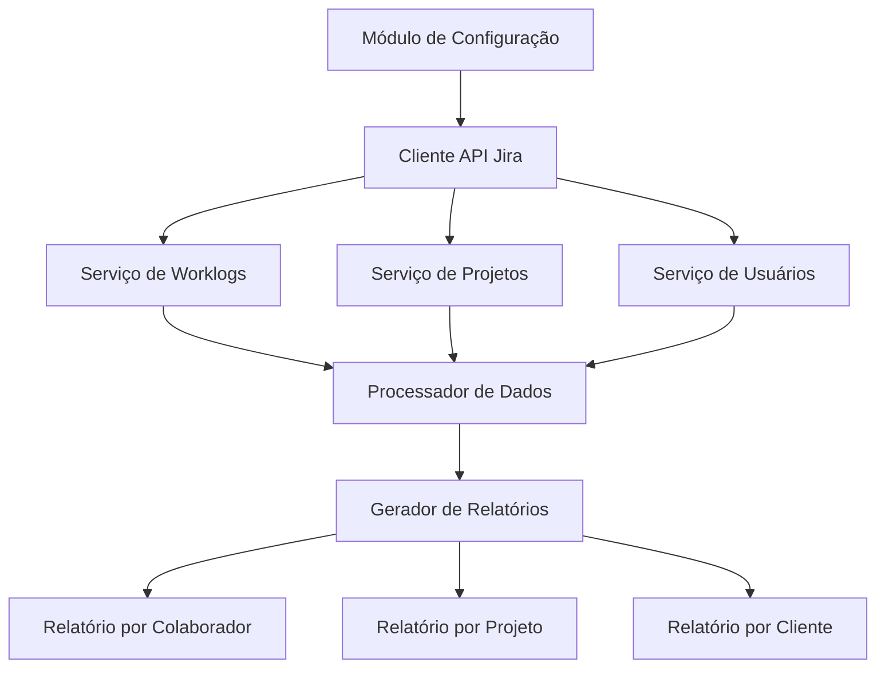
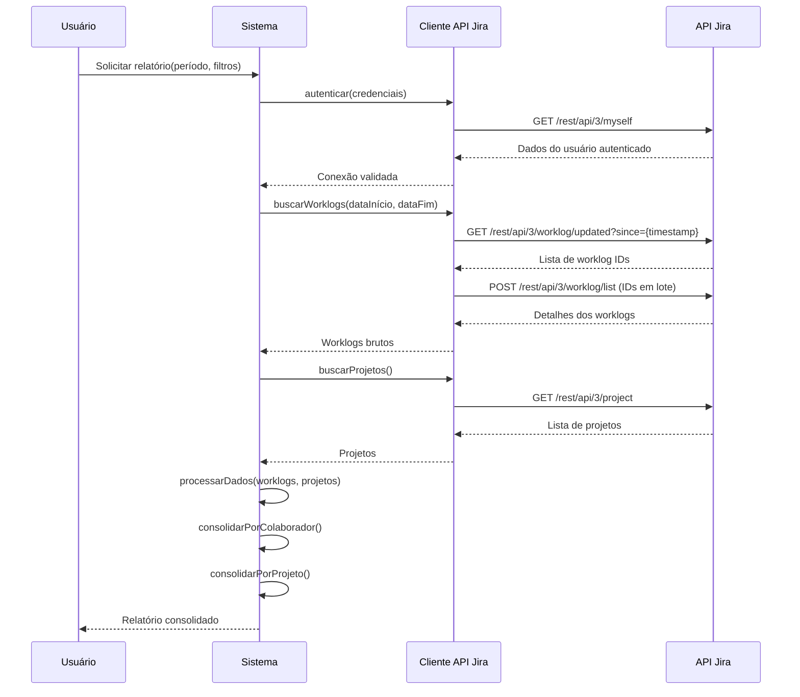
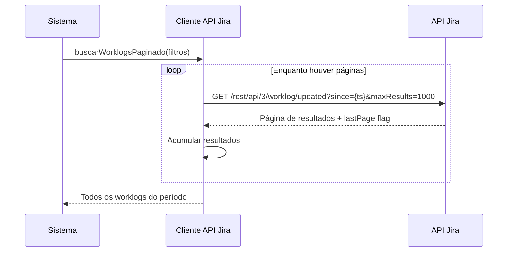

# Documento de Design: Integração Jira Timetracking

## Visão Geral

Este sistema tem como objetivo consumir dados da API REST do Jira para extrair informações de atividades e horas de trabalho (worklogs) registradas por cada colaborador. A partir desses dados, o sistema identifica a qual projeto ou cliente cada registro de horas está associado, permitindo visibilidade completa sobre a alocação de tempo da equipe.

A integração será feita via API REST do Jira (v3), utilizando autenticação por API Token. O sistema realizará consultas periódicas (ou sob demanda) para coletar worklogs, associá-los a projetos e colaboradores, e consolidar essas informações em relatórios estruturados. A arquitetura é modular, separando as responsabilidades de comunicação com o Jira, processamento de dados e apresentação dos resultados.

O fluxo principal consiste em: autenticar no Jira, buscar worklogs por período, enriquecer os dados com informações de projeto/cliente e colaborador, e gerar relatórios consolidados por colaborador, projeto e cliente.

## Arquitetura


## Diagramas de Sequência

### Fluxo Principal: Coleta e Consolidação de Worklogs



### Fluxo de Busca Paginada



## Componentes e Interfaces

### Componente 1: ClienteApiJira

**Propósito**: Encapsular toda a comunicação HTTP com a API REST do Jira, gerenciando autenticação, paginação e rate limiting.

```pascal
INTERFACE ClienteApiJira
  PROCEDURE autenticar(configuracao: ConfiguracaoJira): ResultadoAutenticacao
  PROCEDURE buscarWorklogsAtualizados(desde: Timestamp): Lista DE WorklogId
  PROCEDURE buscarDetalhesWorklogs(ids: Lista DE WorklogId): Lista DE Worklog
  PROCEDURE buscarProjetos(): Lista DE Projeto
  PROCEDURE buscarUsuario(accountId: String): Usuario
  PROCEDURE buscarIssue(issueId: String): Issue
END INTERFACE
```

**Responsabilidades**:
- Gerenciar autenticação via API Token (Basic Auth)
- Implementar paginação automática para grandes volumes de dados
- Respeitar rate limits da API do Jira (429 Too Many Requests)
- Tratar erros HTTP e retornar mensagens descritivas
- Realizar requisições em lote quando possível

### Componente 2: ServicoWorklogs

**Propósito**: Orquestrar a coleta de worklogs e enriquecer os dados com informações de projeto e colaborador.

```pascal
INTERFACE ServicoWorklogs
  PROCEDURE coletarWorklogs(dataInicio: Data, dataFim: Data): Lista DE WorklogEnriquecido
  PROCEDURE filtrarPorColaborador(worklogs: Lista DE WorklogEnriquecido, accountId: String): Lista DE WorklogEnriquecido
  PROCEDURE filtrarPorProjeto(worklogs: Lista DE WorklogEnriquecido, projetoKey: String): Lista DE WorklogEnriquecido
END INTERFACE
```

**Responsabilidades**:
- Coordenar chamadas ao ClienteApiJira para obter worklogs
- Enriquecer worklogs com dados de projeto e colaborador
- Aplicar filtros por período, colaborador e projeto
- Cachear dados de projetos e usuários para evitar chamadas redundantes

### Componente 3: GeradorRelatorios

**Propósito**: Consolidar worklogs enriquecidos em relatórios estruturados por diferentes dimensões.

```pascal
INTERFACE GeradorRelatorios
  PROCEDURE relatorioPorColaborador(worklogs: Lista DE WorklogEnriquecido): Lista DE RelatorioColaborador
  PROCEDURE relatorioPorProjeto(worklogs: Lista DE WorklogEnriquecido): Lista DE RelatorioProjeto
  PROCEDURE relatorioPorCliente(worklogs: Lista DE WorklogEnriquecido, mapeamentoClientes: Mapa): Lista DE RelatorioCliente
  PROCEDURE resumoGeral(worklogs: Lista DE WorklogEnriquecido): ResumoGeral
END INTERFACE
```

**Responsabilidades**:
- Agrupar worklogs por colaborador, projeto e cliente
- Calcular totais de horas por agrupamento
- Gerar percentuais de alocação
- Formatar dados para apresentação

## Modelos de Dados

### ConfiguracaoJira

```pascal
STRUCTURE ConfiguracaoJira
  baseUrl: String
  email: String
  apiToken: String
  maxResultadosPorPagina: Inteiro  // Padrão: 1000
  timeoutSegundos: Inteiro         // Padrão: 30
END STRUCTURE
```

### Worklog

```pascal
STRUCTURE Worklog
  id: String
  issueId: String
  authorAccountId: String
  tempoGastoSegundos: Inteiro
  dataInicio: DataHora
  comentario: String
  criadoEm: DataHora
  atualizadoEm: DataHora
END STRUCTURE
```

### WorklogEnriquecido

```pascal
STRUCTURE WorklogEnriquecido
  worklog: Worklog
  nomeColaborador: String
  emailColaborador: String
  projetoKey: String
  projetoNome: String
  issueSummary: String
  issueKey: String
  horasDecimais: Decimal
END STRUCTURE
```

### Projeto

```pascal
STRUCTURE Projeto
  id: String
  key: String
  nome: String
  clienteAssociado: String
END STRUCTURE
```

### Usuario

```pascal
STRUCTURE Usuario
  accountId: String
  displayName: String
  emailAddress: String
  ativo: Booleano
END STRUCTURE
```

### Issue

```pascal
STRUCTURE Issue
  id: String
  key: String
  summary: String
  projectId: String
END STRUCTURE
```

### RelatorioColaborador

```pascal
STRUCTURE RelatorioColaborador
  nomeColaborador: String
  emailColaborador: String
  totalHoras: Decimal
  detalhesPorProjeto: Lista DE DetalheProjeto
END STRUCTURE

STRUCTURE DetalheProjeto
  projetoKey: String
  projetoNome: String
  clienteAssociado: String
  totalHoras: Decimal
  percentualAlocacao: Decimal
  atividades: Lista DE DetalheAtividade
END STRUCTURE

STRUCTURE DetalheAtividade
  issueKey: String
  issueSummary: String
  dataRegistro: Data
  horas: Decimal
  comentario: String
END STRUCTURE
```

### RelatorioProjeto

```pascal
STRUCTURE RelatorioProjeto
  projetoKey: String
  projetoNome: String
  clienteAssociado: String
  totalHoras: Decimal
  colaboradores: Lista DE ResumoColaborador
END STRUCTURE

STRUCTURE ResumoColaborador
  nomeColaborador: String
  totalHoras: Decimal
  percentualContribuicao: Decimal
END STRUCTURE
```

### ResumoGeral

```pascal
STRUCTURE ResumoGeral
  periodoInicio: Data
  periodoFim: Data
  totalHorasGeral: Decimal
  totalColaboradores: Inteiro
  totalProjetos: Inteiro
  mediaHorasPorColaborador: Decimal
END STRUCTURE
```

## Correctness Properties

As seguintes propriedades de corretude devem ser validadas via Property-Based Testing.

### Property 1: Validação de Configuração (Req 1.1, 1.2, 1.3)
Para qualquer ConfiguracaoJira, a validação deve aceitar configurações válidas e rejeitar inválidas com mensagens de erro descritivas.

### Property 2: Paginação Acumula Todos os Resultados (Req 3.2)
Para toda sequência de páginas, o resultado final deve conter a união de todos os itens sem duplicatas e sem omissões.

### Property 3: Enriquecimento Correto de Worklogs (Req 4.1, 4.2)
Para todo worklog bruto válido, o WorklogEnriquecido deve conter dados corretos de colaborador, projeto e issue, com horasDecimais == tempoGastoSegundos / 3600.

### Property 4: Resiliência no Enriquecimento (Req 4.4)
Worklogs com referências inválidas não devem interromper o processamento dos demais.

### Property 5: Filtragem Retorna Apenas Correspondentes (Req 5.1, 5.2, 5.3)
O resultado filtrado deve conter apenas e todos os worklogs que satisfazem todos os filtros aplicados.

### Property 6: Conservação de Horas nos Agrupamentos (Req 6.1, 7.1)
A soma de horas por colaborador deve ser igual à soma por projeto, e ambas iguais ao total de entrada.

### Property 7: Percentuais Somam 100% (Req 6.4, 7.3)
Percentuais de alocação por colaborador e contribuição por projeto devem somar 100%.

### Property 8: Completude Estrutural dos Relatórios (Req 6.2, 6.3, 7.2)
Cada agrupamento deve ter sub-itens não vazios.

### Property 9: Agrupamento por Cliente (Req 8.1, 8.2)
Projetos sem mapeamento devem aparecer sob "Sem Cliente", e a soma de horas por cliente deve igualar o total geral.

### Property 10: Consistência do Resumo Geral (Req 9.1, 9.2)
Totais e médias do resumo devem ser consistentes com os dados de entrada.

### Property 11: Mensagens de Erro HTTP (Req 10.2)
Erros HTTP devem conter código e mensagem de resposta.

### Property 12: Round-trip de Serialização JSON (Req 11.1, 11.2, 11.3)
Serializar e desserializar qualquer modelo deve produzir objeto equivalente ao original.
